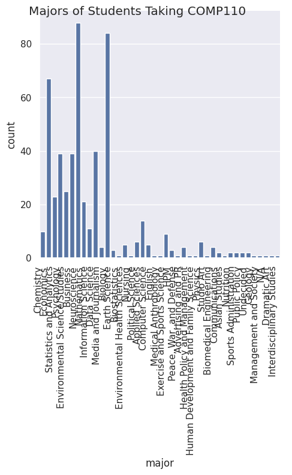
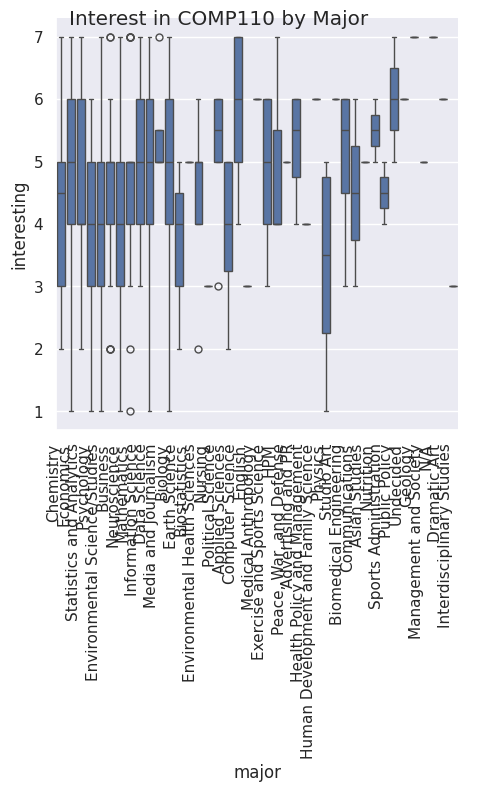
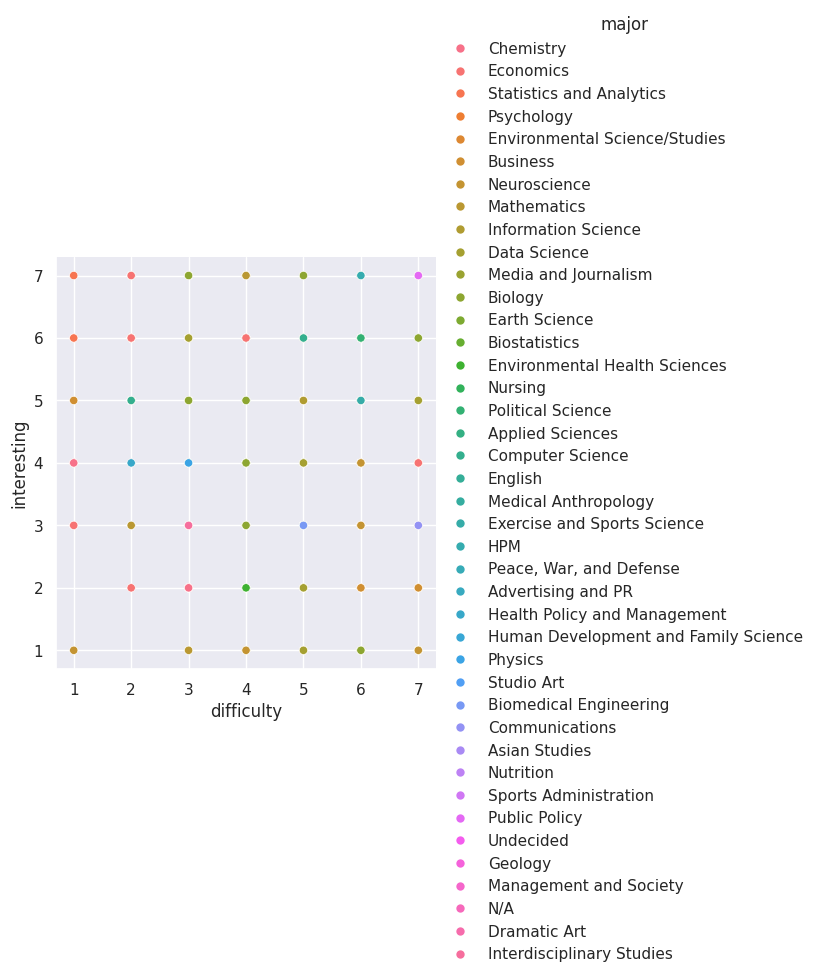

---
# Do not edit the text between these lines!
layout: default
---

# COMP110 Data Analysis Project

## Idea
I investigated whether differences in majors had an impact on difficulty and interest in COMP110.

## Analysis Summary
I analyzed survey responses using Python and seaborn.

## Key Findings
- There is a heavy representation of neuroscience, biology, and economics majors in COMP110
- Non-computer science majors ranked their interest as a 4.64, while computer science majors ranked their interest as a 6 (on average)
- There was a positive correlation between difficulty and interest
- There is a group of non-majors that falls into the high-difficulty/low-interest quadrant of the scatterplot

## Conclusion
This data supports my recommendation that their is more diverse problem sets added to the course to help non-majors see the utility of programming in their fields of interest.

## Visualization 1

## Visualization 2

## Visualization 3

<!-- This is a comment. Below, you'll see code for inserting an image. To make this image appear, update <custom-path>. To add an image, save it inside the imgs folder of this repository. -->
/static/imgs/logo.png" alt="Image of Comp110 rainbow logo. "  width="500"/>
